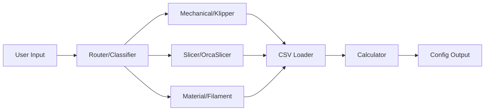

# Minimal 3DP Unified Intelligence Platform (M3DP-UIP)

[](https://www.python.org/downloads/)
[](https://github.com/minimal3dp/m3dp-uip/actions/workflows/ci-matrix.yml)
[](#-testing)
[](#-testing)
[](https://fastapi.tiangolo.com/)
[](https://github.com/astral-sh/ruff)
[](https://opensource.org/licenses/MIT)

AI-powered diagnostic platform for 3D printing that uses vision models and structured knowledge bases to troubleshoot print failures.

## 🎯 Overview

M3DP-UIP combines computer vision (Gemini 1.5 Pro) with a structured CSV knowledge base to provide accurate, formula-based solutions for 3D printing issues - not generic LLM advice.

**Key Features:**
- 📸 **Vision-based defect detection** using Gemini 1.5 Pro
- 🧮 **Formula-driven calculators** from Klipper calibration CSVs
- 🎯 **Router architecture** to avoid context window pollution
- 📊 **Structured knowledge base** of OrcaSlicer and Klipper settings
- 🚀 **Fast API backend** with Python 3.12+ and FastAPI
- 🎨 **Interactive frontend** (prototype in vanilla JS, migrating to React)

Part of the [minimal3dp.com](https://minimal3dp.com) ecosystem (10K+ YouTube subscribers).

## 🚀 Quick Start

### Prerequisites

- Python 3.12+
- UV (Python package manager)
- Git

### Installation

```bash
# Clone repository
git clone https://github.com/minimal3dp/m3dp-uip.git
cd m3dp-uip

# Run setup script (recommended)
chmod +x scripts/setup.sh
./scripts/setup.sh

# Or manual setup:
python -m venv .venv
source .venv/bin/activate
pip install uv
uv pip install -e ".[dev]"
cp .env.example .env
# Edit .env with your API keys
pre-commit install
```

### Run Development Servers (Full Stack)

Use the combined runner to start both backend (FastAPI) and frontend (Nuxt) with one command:

```bash
chmod +x scripts/dev-all.sh   # first time only
./scripts/dev-all.sh
```

Environment overrides:
```bash
BACKEND_PORT=9000 FRONTEND_PORT=3100 ./scripts/dev-all.sh
```
Frontend will automatically use `NUXT_PUBLIC_API_BASE` pointing at the backend port (override if needed):
```bash
NUXT_PUBLIC_API_BASE=https://api.dev.local ./scripts/dev-all.sh
```

Access:
- Backend API: http://localhost:${BACKEND_PORT:-8000}
- Frontend:    http://localhost:${FRONTEND_PORT:-3000}

### Run Backend Only

```bash
# Using script
./scripts/run_dev.sh

# Or manually
source .venv/bin/activate
cd backend
uvicorn app.main:app --reload
```

Access the API:
- **API**: http://localhost:8000
- **Swagger Docs**: http://localhost:8000/docs
- **ReDoc**: http://localhost:8000/redoc

### Run Frontend Prototype (Legacy Static)

```bash
# Open index.html in browser or use local server:
python -m http.server 8080
# Access: http://localhost:8080
```

## 📁 Project Structure

```
m3dp-uip/
├── .github/
│   └── copilot-instructions.md    # AI assistant guidelines
├── backend/
│   ├── app/
│   │   ├── api/endpoints/         # FastAPI routes (diagnosis, calculators)
│   │   ├── core/                  # Settings / environment config
│   │   ├── data/                  # CSV knowledge base (placeholders)
│   │   ├── services/              # Router/classification, future calculators
│   │   └── main.py                # FastAPI app entry point
│   └── tests/                     # Test suite (root & health)
├── docs/                          # Documentation
├── research/                      # Research papers
├── scripts/                       # Utility scripts
├── index.html                     # Frontend prototype
└── pyproject.toml                # Project config
```

## 🏗️ Architecture

### The "Router" Pattern

The core innovation is **avoiding context window pollution**:

1. **Router classifies** issue type: `Mechanical` | `Slicer` | `Material`
2. **Retrieval fetches** only relevant CSV data
3. **Calculator renders** precise formula-based solutions



### Tech Stack

- **Backend**: FastAPI (Python 3.12+), pandas, Pydantic
- **Vision**: Google Gemini 1.5 Pro
- **Frontend**: React + Vite + Tailwind CSS (planned)
- **Deployment**: Vercel
- **Tooling**: Ruff (linter/formatter), pytest, pre-commit

## 🔌 API Endpoints

Core backend endpoints (current Phase 1 / early Phase 2):

| Endpoint | Method | Purpose | Notes |
|----------|--------|---------|-------|
| `/` | GET | Root health + CSV/calculator metadata | Returns loaded CSV list and calculators summary |
| `/health` | GET | Lightweight health probe | Suitable for container orchestration |
| `/api/v1/calculators/rotation-distance` | POST | Extruder rotation distance calculator | Formula: `(current * actual) / requested` |
| `/api/v1/calculators/pressure-advance` | POST | Pressure advance heuristic (placeholder) | Will integrate precise CSV data Phase 2 |
| `/api/v1/calculators/input-shaping` | POST | Resonance data extraction (placeholder) | Future: integrate real resonance capture |
| `/api/v1/diagnosis/analyze/text` | POST | Full text diagnostic routing | Uses RouterService; falls back to keyword + CSV search |
| `/api/v1/diagnosis/analyze/image` | POST | Vision-based defect analysis | Gemini 1.5 Pro integration (planned) |
| `/api/v1/diagnosis/classify` | POST | Low-cost keyword classification | Fast prefetch path for UI |

Deprecated/Removed:
| Endpoint | Change |
|----------|--------|
| `/api/v1/diagnosis/calculators` | Removed (duplicate of calculators listing) |

Example (Rotation Distance):
```bash
curl -X POST http://localhost:8000/api/v1/calculators/rotation-distance \
    -H 'Content-Type: application/json' \
    -d '{"current_rotation_distance":33.5, "requested_extrusion":100, "actual_extrusion":98.5}'
```

Example response (truncated):
```json
{
    "new_rotation_distance": 33.0,
    "klipper_config": "rotation_distance: 33.0",
    "within_tolerance": true,
    "recommendation": "✅ Within ±2mm tolerance. Update value and re-test."
}
```

Failure resilience: `/api/v1/diagnosis/analyze/text` downgrades to `handler: "fallback_csv_router"` (keyword + CSV search) if RouterService fails—maintaining low cost and availability.

## 🧪 Testing

```bash
# Activate environment
source .venv/bin/activate

# Run all tests
./scripts/run_tests.sh

# Run with coverage (HTML + terminal summary)
pytest --cov=app --cov-report=html:backend/htmlcov

# Run specific test
pytest backend/tests/test_root.py::test_health
```

Coverage badge updates only when a valid backend Python project exists.

## 🎨 Code Quality

```bash
# Format and lint
./scripts/format_code.sh

# Or manually:
ruff format .
ruff check . --fix
```

Pre-commit hooks run automatically on commit.

## 📚 Documentation

- **[Development Guide](docs/DEVELOPMENT.md)** - Complete setup and workflow
- **[Scripts Guide](docs/SCRIPTS.md)** - Using utility scripts
- **[TODO.md](TODO.md)** - Development roadmap and tasks
- **[API Docs](http://localhost:8000/docs)** - Interactive API documentation (when server running)

## 🗺️ Development Roadmap

See [CONTRIBUTING.md](CONTRIBUTING.md) for contribution guidelines. A future `TODO.md` will track granular tasks.

**Current Phase:** Phase 1 - Foundation
- ✅ Backend scaffold (FastAPI, health endpoints)
- ✅ Basic tests & coverage wiring
- ✅ Code quality tooling (Ruff, pre-commit)
- 🔄 CSV knowledge base ingestion (pending)
- 🔄 Vision API integration (pending)
- 🔄 Calculator implementations (pending)

## 🤝 Contributing

1. Create feature branch: `git checkout -b feature/your-feature`
2. Make changes and test: `./scripts/run_tests.sh`
3. Format code: `./scripts/format_code.sh`
4. Commit: `git commit -m "feat: your feature"`
5. Push and create PR to `develop`

Follow [Conventional Commits](https://www.conventionalcommits.org/) for commit messages.

## 📖 Background & Research

### Feasibility Analysis

Overall Viability: High

The project identified in 2407.04180v1 (likely referencing recent advancements in 3D-LLMs or Vision-Language Models for manufacturing) supports the core premise: AI can now "see" manufacturing defects.

However, the "Minimal 3DP" advantage is the Structured Knowledge Base.

Pure AI Approach (Low Accuracy): Asking an LLM "Fix my print." Result: Generic, often wrong advice.

The Minimal 3DP Approach (High Accuracy): Using AI to map a user's visual symptom to a specific row in your OrcaSlicer Recommendations.csv or Klipper Calibrations.csv.

Core Challenge:
The main challenge is Context Window Pollution. If you feed an LLM all your CSVs at once, it gets confused.
Solution: Use a "Router" architecture.

Input: User Image/Text.

Router: Classifies issue as "Mechanical" (Klipper), "Slicer" (Orca), or "Material" (Filament Data).

Retrieval: Fetches only the relevant CSV data (e.g., Klipper Calibrations - Pressure Advance.csv).

Output: Precise instructions + Interactive Calculator.

2. Recommended Tech Stack

Backend: Python (FastAPI)

Reasoning: Python is the industry standard for RAG (Retrieval Augmented Generation). You can use the pandas library to read your CSVs natively.

Libraries: fastapi, pandas (for CSV math), pydantic (data validation), google-generativeai (Vision).

Frontend: React (Vite + Tailwind CSS)

Reasoning: You need a highly interactive UI for the calculators (updating "Steps per mm" in real-time).

Libraries: lucide-react (icons), recharts (if you want to graph Input Shaping later).

Database: Google Firestore

Reasoning: You need to store User Sessions (History of diagnosis).

Structure:

users/{uid}/printers/{printer_id} (Store printer profiles: Nozzle size, MCU type).

artifacts/public/knowledge_base (Where your digested CSV data lives).

3. Proposed Scaffold

minimal-3dp-platform/
├── backend/
│   ├── app/
│   │   ├── main.py              # API Entry point
│   │   ├── core/
│   │   │   ├── config.py        # Env variables
│   │   │   └── security.py      # Auth logic
│   │   ├── api/
│   │   │   ├── endpoints/
│   │   │   │   ├── diagnosis.py # Handles Image/Text upload
│   │   │   │   └── calc.py      # Pure python functions mirroring your CSV formulas
│   │   ├── services/
│   │   │   ├── llm_service.py   # Interface with Gemini/OpenAI
│   │   │   └── csv_loader.py    # Loads your Reference CSVs into memory
│   │   └── data/                # Your raw CSV files go here
│   │       ├── klipper_calibrations/
│   │       └── orca_recommendations/
├── frontend/
│   ├── src/
│   │   ├── components/
│   │   │   ├── DiagnosticWizard.tsx
│   │   │   ├── calculators/     # Reusable components for specific CSVs
│   │   │   │   ├── RotationDistanceCalc.tsx
│   │   │   │   └── FlowRateCalc.tsx
│   │   ├── hooks/               # Custom hooks for API calls
│   │   └── types/               # TypeScript interfaces matching your CSV columns


4. TODO.md

Phase 1: Data Digestion (The Foundation)

[ ] Audit CSVs: Standardize headers in Klipper Calibrations and OrcaSlicer Recommendations. Ensure numerical columns are actually numbers (remove "mm" or "%" symbols inside the cells).

[ ] Python Ingestion Script: Write a script to parse your CSVs into JSON dictionaries.

Example: Convert Klipper Calibrations - Extruder Rotation Distance.csv into a Python Class RotationDistanceCalculator.

[ ] Vector Embeddings: Create embeddings for the "Description" or "Notes" columns in your CSVs. This allows the user to search "blobs on corner" and matches it to your "Seam Position" or "Pressure Advance" rows.

Phase 2: The Core Engine (Backend)

[ ] Setup FastAPI: Initialize project with Python 3.10+.

[ ] Vision Endpoint: Create an endpoint /analyze that accepts an image.

Use Gemini 1.5 Pro with a System Prompt: "You are an expert 3D printing diagnostician. Analyze this image for defects. Return a JSON object classifying the error type (e.g., VFA, Under-extrusion, Layer Shift)."

[ ] Calculator Logic: Port the formulas from your spreadsheets into Python functions.

Task: Implement Rotation Distance = Full Steps * Micro Steps / E Steps.

Task: Implement Flow Value = start + (height-measured * step) (from Max Volumetric Speed CSV).

Phase 3: The User Interface (Frontend)

[ ] Scaffold React: Setup Vite + Tailwind.

[ ] Wizard Component: Create a step-by-step flow:

Context: (User inputs Printer Name, Filament Type).

Input: (Upload Image OR Describe Issue).

Result: (Display AI Analysis).

Action: (Render the specific Calculator Component required to fix it).

[ ] Calculator Components: Build React components that mirror the "User Input" cells in your spreadsheets.

Phase 4: Deployment & Polish

[ ] Auth: Implement Firebase Auth (or simple email login).

[ ] State Persistence: Save the user's "Printer Profile" (so they don't have to re-enter '0.4mm nozzle' every time).

[ ] Deploy: Vercel (Frontend) + Render/Fly.io (Backend).

Future Manufacturing / Grant Goals (Alignment)

[ ] Data Collection: Anonymize uploaded images to build a proprietary dataset of "Failed Prints vs. Corrected Settings" to train a custom model (fitting the "Data-Driven Content Strategy").
